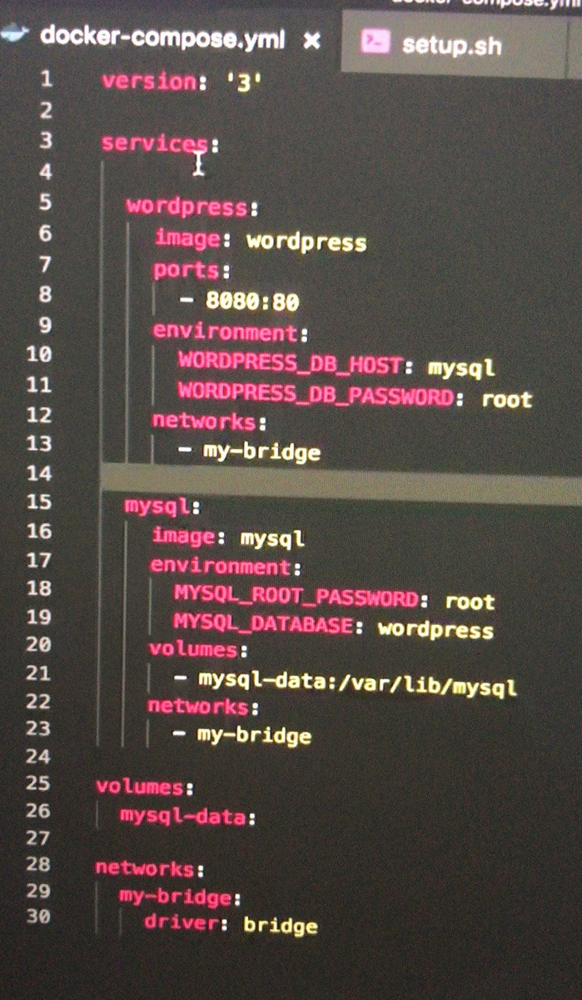

### Docker学习笔记

####什么是`image`
* 创建的`linux`系统我文件很小 ，因为其使用了宿主机上的linux内核，并对原先的OS做了精简处理。
#### 如何构建 `DockerImage`
* `docker build -t wyq@163.com/hello-world .` 指定容器的名称。【Image ---> continer 】
* `Image`是可读的，【负责APP的存储于分发】`Container`是可读可写的【负责运行APP】。
*  交互式运行容器的方法 ： `docker run -it centos`
* 一条命令删除所有退出的容器 ：` docker rm $(docker container ls -f "status=exited" -q)`
### 创建新的`Image`
* 通过`docker commit` 如`docker commit busy_heyrovsky wyq163/centos-vim` 在原有镜像的基础上创建。【但是不提倡】`Image` 不是透明的，可能存在不安全的内容。 
* 建议使用`Dockerfile`创建。 【语法以及实践】：
```
FROM  scrach  [空镜像]
FROM  centos [base Image] 尽量使用官方的镜像作为base Image 【处于安全考虑】！ 
LABEL  Image的信息。

1、WORKDIR 设定当前的工作目录。 exp WORKDIR/root # 如果没有该目录会自动创建test目录。
exec：WORKDIR /root
      WORKDIR exp
     pwd = /root/exp 【用WORKDIR 不要使用RUN cd】尽量使用绝对目录。   
2、ADD& COPY【将本地文件添加到Image文件里面】。
 ADD 不仅可以添加文件到指定的文件还可以解压缩  如：
  ADD hello/
  ADD test.tar.gz / # 添加到根目录并解压。
 
  exec 
   WORKDIR /root
   ADD hello test /
   pwd # /root/test/hello 
 # 大部分情况，COPY优于ADD， ADD 除了COPY的功能外还可以解压。 添加远程文件\目录使用curl 或者wget。

ENV 设定环境变量或者一个常量
 尽量使用ENV 增加可维护性、

VOLUME和EXPOSE【存储与网络】
 
CMD&&ENTRYPOINT
CMD【设置容器启动后默认执行的命令和参数】。
ENTRYPOINT【设置容器启动时运行的命令】。
shell&& exec格式
shell
  from centos
  env name docker
  entrypoint echo "hello &name"

exec
  from centos
  env name docker 
  entrypoint ["/bin/bash","-c","echo hello &name"]
 
【CMD】
  如果定义多个CMD 只有最后一个会被执行。

【ENTRYPOINT】
 让容器以应用程序或者服务的形式运行；
 不会被忽略一定会执行；
```

### 容器资源限制
*  `docker run --memory=200MB `
 
 ### `docker`网络
  容器之间通信可以使用 `link` 但是不推荐。
  ```
   1、docker network ls
``` 
 *  创建Bridge 并让容器连接指定bridge 
 ```
   docker network create -d bridge  my-bridge
  
   docker run -d --name XXX --network my-bridge XXX 
    
    # 将已经启动的容器连接到新的network
   docker network connect  my-bridge XXX 
```
* `host` && `none`

### `docker` 多机器通信
* 同一台机器 `docker bridge`以及`network` 连接。
*  两个容器在不同的机器上 ： `VXLAN ` 以及 `Docker Overly` 。【有两个IP地址 分别负责对外通信， 以及容器本身的IP地址】  

### `docker`容器持久化村存储以及数据共享
  * 基于本地的文件系统的Volume。
   ```
   docker run -d --name mysql1 -e MYSQL_ALLOW_EMPTY_PASSWORD=true mysql 【默认会在/var/lib/docker/volumes/目录下生成一个目录作为持久化所需要的目录】。
   docker run -d -v mysql:/var/lib/mysql --name mysql1 -e MYSQL_ALLOW_EMPTY_PASSWORD=true mysql 【默认会在/var/lib/docker/volumes/目录下生成一个目录作为持久化所需要的目录】。

  ```
   - docker后台自动创建。 【Data Volume】`docker run -v mysql:/var/lib/mysql` 
   
   - 绑定挂载的数据卷。【具体位置由用户指定】 （bind Mouting） 运行容器时指定。  
  * 第三方的存储方案NAs、AWS。
  
  #### `docker compose`使用教程
  
  #####  三大概念
  * `service`
     `service`代表一个`container`，该`container`可以从`docker`仓库下载也可以是从本地通过`DockerFile`中
     构建出来。启动时指定`network`和`Volume`。例如：
     ```
     ##### 远程仓库下载
       services:
        db:
          image: postgres:9.4
          volumes:
            - "db-data:/var/lib/postgresql/data"
          networks:
            - back-tier
     ## 启动
      docker run -d --network back-tier -v db-data:/var/lib/postgresql/data postgres:9.4
    ###### 基于本地构建
       services:
         worker:
           build: ./worker
           links:
             -db
             -redis
           networks:
             - back-tier
     ```
    
    
     * `NetWork`
  
  * `Volumes` 
  
  ### 使用`docker-compose`做负载均衡。
  
 ### 容器编排
 * 分布式环境下如何部署以及管理`docker`容器。 
 * `Swarm`工具`docker`内部已经集成。
  - `Service`和`Replicas`
  - `play-with-docker` 
 
 ### 常用命令
 * 显示所有的docker容器的ID号 `docker ps -aq`
 * 删除所有docker容器的 `docker rm &(docker ps -aq)`
 * 查看容器的详细信息 `docker inspect dockerId`
 * 通过`-e`参数给容器设置环境变量 `docker run -d --name test1 -e PENG=hell`可以在进入容器后 使用`env`查看 使用`-e`参数传递参数配置信息。 
 
### 知识点总结
* `docker`容器之间如何通信。
 - 通过容器Ip地址，但是重启后容器地址会改变。
 - 通过宿主机 `IP：port` 方式访问，【依靠暴露在外的端口进行访问】。
 - 通过`link`建立连接。
 - 桥接网络。