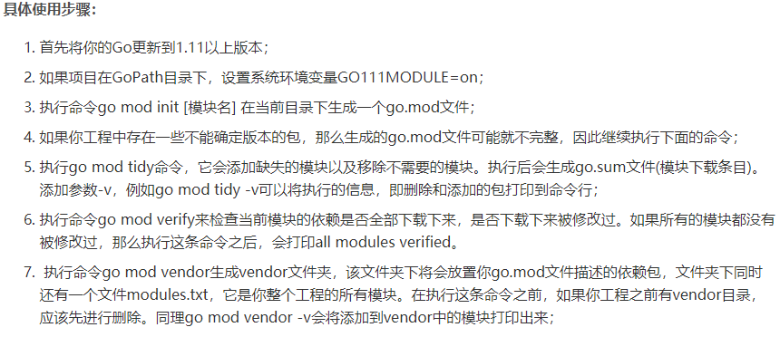

## `golang`管理工具
#### `golang govendor`依赖管理工具 
 * 1. `govendor` 是`golang`的依赖包管理工具可避免不同用户
`clone` 同一个项目后，从外部获取不同依赖库版本饿问题，`govendor`会将项目依赖添加到
。`vendor`项目下，并且该目录`vendor_json`文件会保存添加的依赖包的路径信息。
  
   2.  `golang`项目中的`go`文件在查找依赖顺序为先在`vendor`中查找，`vendor`中没有在`Gopath`中查找，
都没有则在`goRoot`中查找。[参考教程](https://blog.csdn.net/qq1083062043/article/details/86639728)

#### `go-modules`
  * 1. `golang`包管理工具一直比较麻烦。在`1.11`后出现了`go modules` 官方提出的新的新的包管理工具。其是对`vendor`
  的一次升级。
    1. [简单的使用](https://blog.csdn.net/cnwyt/article/details/85695947)
    2.  `go moudles`中`golang`提供了一个`GO111MODULE` 默认为`auto`， 导致`moudles` 默认在 `gopath/src` 路径下不可使用。可以通过`go env -w GO111MODULE=on`设置开启。
    [简单使用教程](https://www.cnblogs.com/pu369/p/12068645.html)，如果当前目录中有`go-modules` 就使用
    `go modules` 否则使用旧的`gopath`和`vendor`机制。
    2. 
    3. 让项目同时支持`govendor`与`go-modules` [参考教程](https://www.cnblogs.com/baizx/p/9925509.html)  
    4. [参考文章1](https://www.cnblogs.com/apocelipes/p/10295096.html)  
    4. [参考文章2](https://www.cnblogs.com/apocelipes/archive/2018/08/25/9534885.html)  
